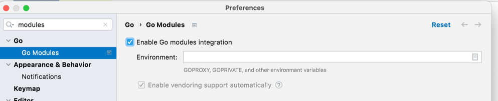

# go-playground

📚 Learning and experimenting with the [Go programming language](https://golang.org/).

## Standalone subprojects

This repository illustrates different concepts, patterns and examples via standalone subprojects. Each subproject is
completely independent of the others and do not depend on the root project. This _standalone subproject constraint_
forces the subprojects to be complete and maximizes the reader's chances of successfully running, understanding, and
re-using the code.

The subprojects include:

### `hello/`

A "hello world" Go program.

See the README in [hello/](hello/).

### `misc/`

Exploring miscellaneous features and concepts of Go.

See the README in [misc/](misc/).

## Learning Strategy

These are the components I'm using to guide my learning:

* [x] Set up instructions
    * I have my own installation instructions, including Bash autocompletion, in the section named "Install Go" in my
      personal [my-config](https://github.com/dgroomes/my-config/blob/main/mac-os/MACOS_SETUP.md).
* [x] [GoLand IDE](https://www.jetbrains.com/go/)
    * Make sure to enable Go modules integration in GoLand. See the below screenshot for the setting:
      
* [ ] [Official Go docs: *Tutorial: Get started with Go*](https://golang.org/doc/tutorial/getting-started)
    * [x] DONE [*Tutorial: Get started with Go*](https://go.dev/doc/tutorial/getting-started)
    * [x] DONE [*Tutorial: Create a Go module*](https://go.dev/doc/tutorial/create-module)
      * > Go code is grouped into packages, and packages are grouped into modules. Your module specifies dependencies needed to run your code, including the Go version and the set of other modules it requires. 
      * I haven't yet grokked what it means for a Go project (module) to *track* a dependency. Specifically, when you
        run `go mod tidy` in the greeting/hello example and it adds `require example.com/greetings v0.0.0-00010101000000-000000000000`
        to the Go mod file. Is this like the entries you find in a *lock* file? E.g. `package.lock` or `Pipefile.lock`?
        I appreciate that Go is using a word ("tracked") for this concept. UPDATE: well wait but the word `require` is in
        the mix too... UPDATE 2: And no it's not like a lock file because there is no hash (fingerprinting).
* [ ] [Official Go docs: *How to Write Go Code*](https://golang.org/doc/gopath_code)

## Observations about Go

These are my observations about Go the programming language, the surrounding toolchain, the ecosystem of Go libraries,
and the Go community.

* It's really cool that you can add an import statement and then do `go mod tidy` to add the module as a requirement.
  That's an interesting inversion. Normally (in environments like Java) it's up to you to find the dependency and add it
  to the project model file (`build.gradle` for Gradle, `pom.xml` for Maven).
* I like the omission of commas in the import statement. When the compiler can just as easily make sense of a grammar
  without commas, in a certain context, then why require commas? Bash is comma-less, for example! I bet it's hard on the
  compiler and the IDE and will result in harder to read compiler error messages.
* GoLand doesn't have an [intention action](https://www.jetbrains.com/help/idea/intention-actions.html) for converting a
  string to a raw string. I'm not sure why. Do raw strings work much differently than raw/multiline strings in other
  languages? I use this all the time in Intellij on Kotlin and JavaScript code.
* I really like that I can name a local variable `_` so that the Go compiler won't complain about an unused variable.
* I don't have to declare variables with a `var` keyword? That's pretty cool. Note that you need `var` I think only whe
  you don't assign the variable in the same statement.
* The code samples in the docs at <https://pkg.go.dev> is amazing. Wow! You can even edit and run the code samples right there!

## Wish list

General clean-ups, TODOs and things I wish to implement for this project:

* [x] DONE Print the JSON document. I'd like to print the JSON string in the program output. This gives
  better contrast and proves that the program actually does something with JSON.
* [ ] Figure out how to modularize Go code. Go 1.18 added support for "workspaces" which allows you to work
  with "multi-module workspaces". This is generally the design paradigm that I'm used to in my
  projects in other languages. Read [the official tutorial on workspaces](https://go.dev/doc/tutorial/workspaces). Say,
  for example, that I want to build a utility program called `word-count` and another program called `json-formatter`.
  I don't want the `word-count` program to be polluted with any dependencies that are specific to `json-formatter`. How
  do I do this?
* [x] DONE (`cmd/` is the popular convention) I want a second `main` function because I want a second runnable demo program. If I create a file in the root
  directory, and it defines a `main` function, then when I do `go run .` it will complain about "can't redefine main".
  What are my options? Is there an idiomatic thing to do?
* [x] DONE Exec an external process.
* [x] DONE Split up into my usual "standalone subprojects" learning repository style.

## Reference

* <https://pkg.go.dev/>
    * What do I call this website, the "Go package site"?
* [Official blog post: *Tidying up the Go web experience*](https://go.dev/blog/tidy-web)
    * The marketing for Go is great! I wish Java had something similar.
* [The `fmt` package docs](https://pkg.go.dev/fmt)
    * Read this to understand the format verbs like `%s` and `%q`.  
* [StackOverflow answer for the question: *What is a sensible way to layout a Go project*](https://stackoverflow.com/a/14870666)
